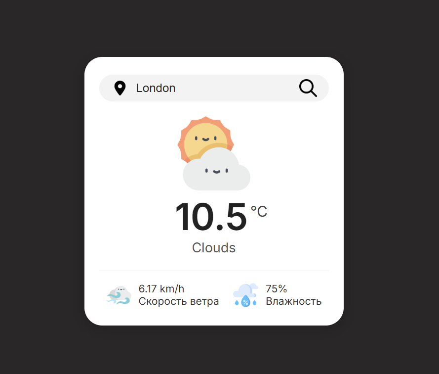

# 🌤️ Weather-App

Интерактивное веб-приложение, которое показывает текущую погоду по названию города или страны.  
Приложение динамически обновляет фоновое изображение в зависимости от погодных условий,  
а также отображает температуру, влажность и скорость ветра.  
Ввод можно выполнить как через кнопку, так и нажатием **Enter**.

---

## ✨ Функционал

- 🔍 Поиск погоды по названию города или страны  
- 🌦️ Динамическое обновление фонового изображения в зависимости от погоды  
- 🌡️ Отображение температуры, влажности и скорости ветра  
- ⌨️ Возможность ввода города с помощью клавиши **Enter**  
- ⚠️ Страница "Не найдено", если введён неверный город  

---

## 🧠 Технологии

- **HTML5**  
- **CSS3**  
- **JavaScript (Vanilla JS)**  
- **OpenWeather API**

---

## 🚀 Запуск проекта

1. Склонируй репозиторий:
  
   ```bash
   git clone https://github.com/твоя-ссылка-на-репозиторий.git
   
   # Переходим в директорию проекта
   cd Weather-App

   # Открываем в браузере
   index.html
   ```
   
## 📸 Превью 


---

🧩 API:
Проект использует OpenWeatherMap API.

👨‍💻 Автор

Exmar — Fullstack Developer

📧 Telegram: @Exmar1
